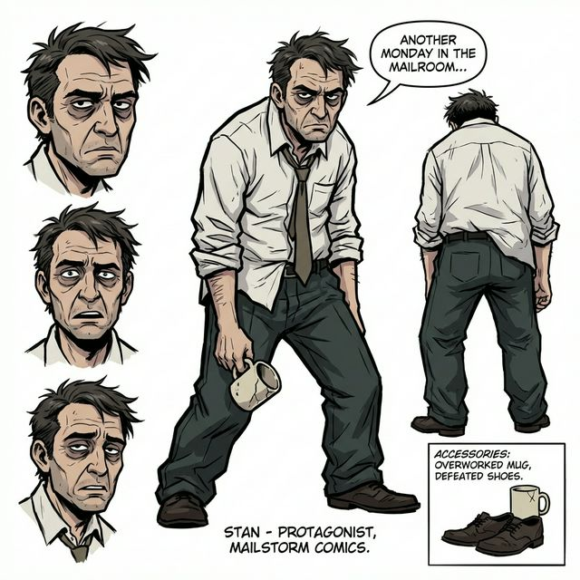
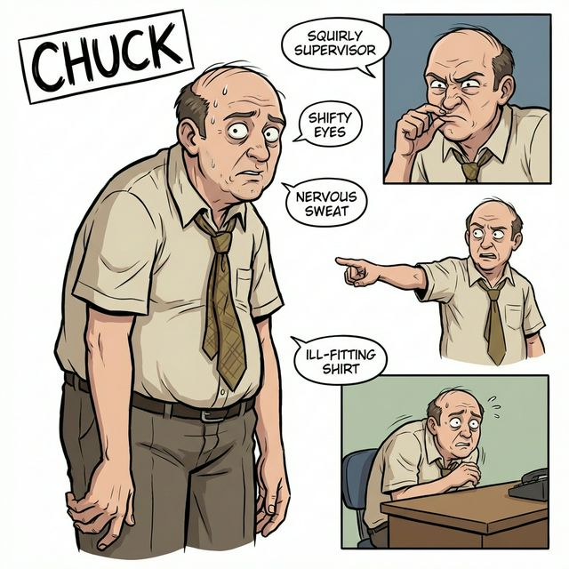
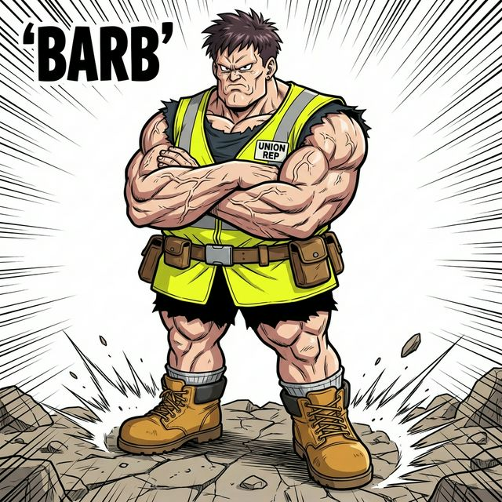
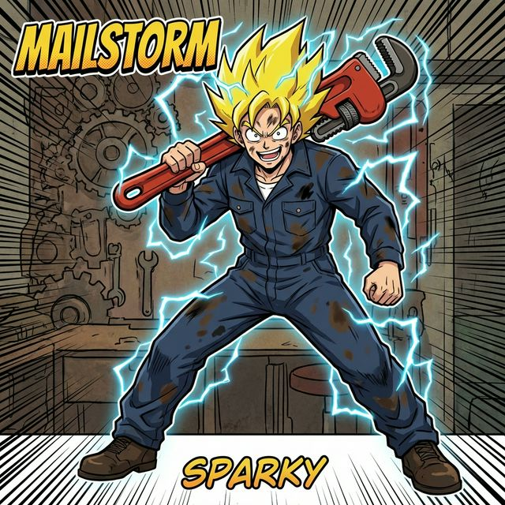
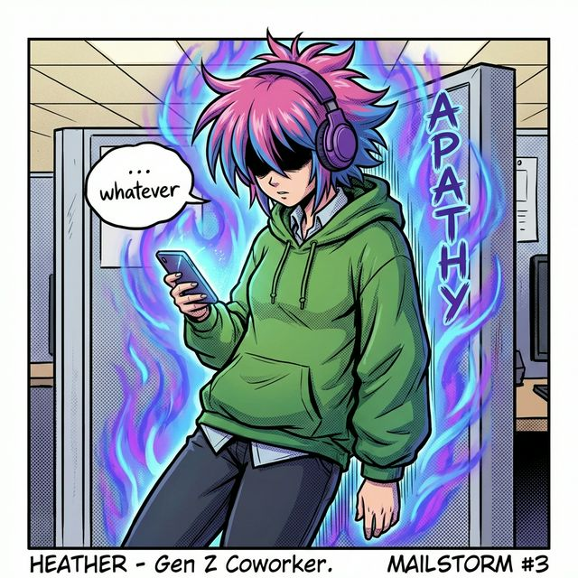

# Mailstorm Characters

## Stan
**Role**: The Protagonist.
**Bio**: An average salaryman just trying to get through the day. He holds a coffee mug like it's the source of his power (it might be).

## Chuck
**Role**: The Supervisor.
**Bio**: Incompetent, power-hungry, and possibly not entirely human. He channels Frieza energy but uses it for micromanagement instead of planetary destruction.

## Barb
**Role**: The Union Rep.
**Bio**: The strongest entity in the building. When she crosses her arms, mountains tremble. She ensures safety regulations are followed... or else.

## Sparky
**Role**: Maintenance Tech.
**Bio**: He's seen things in the vents. Dark things. He wields a wrench with the skill of a master swordsman and vibrating with caffeine energy.

## Heather
**Role**: Gen Z Coworker.
**Bio**: Unbothered. Moisturized. In her lane. Focused. She has "ok boomer" energy that can literally reflect energy blasts.

