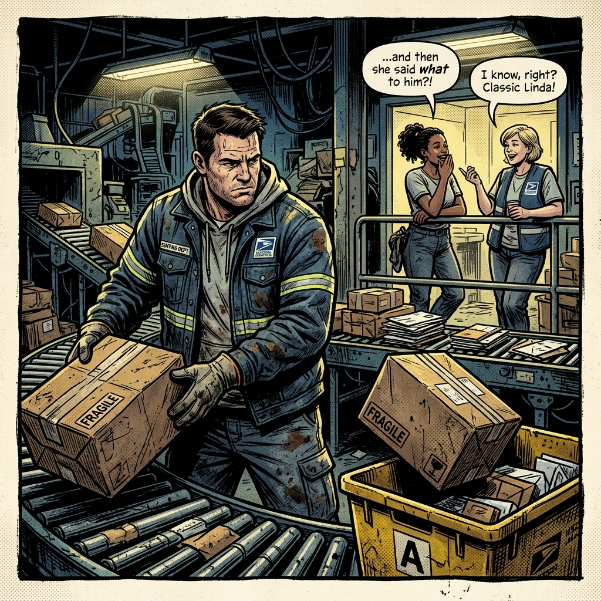
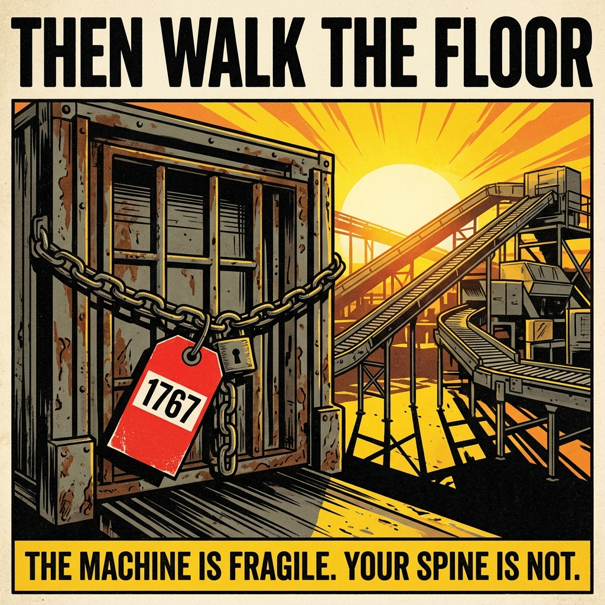

# 🛸 CAPTAIN'S LOGS // THE ARCHIVES OF THE UNBROKEN
This file houses the running logs of the daily grind at **Metro Hub South (The Pit)**, sobriety tracking, and developmental progress for **Benchmark Apps, LLC**.

---

## 🛸 STARDATE: 05.21.2026 // DAY 1
### 07:45 BLACKOUT STANDARD // THE SHITSHOW CHRONICLES
**LOCATION:** MAIN QUARTERS  
**STATUS:** INITIAL REBOOT // COGNITIVE FOG: ZERO // INTAKE: ZERO  

> **YELLOW CAPTION:** The universe is a burning dumpster fire, but today, the engine room didn't need synthetic garbage to start chugging.

#### 💀 SYSTEM DIAGNOSTICS: THE CORPSE WE CALL A BODY
* **NEURAL DRIVE:** [UNEXPECTEDLY NOT DEAD] Woke up with actual goddamn motivation instead of the usual existential dread. Brain-housing group is firing on all cylinders.
* **CHEMICAL DEPOT:** ZERO INTAKE. No weed. No nicotine. The lungs aren't filled with flavored chemical steam, and the brain isn't marinating in THC before the sun's even fully up. It’s a fucking Christmas miracle.
* **THE ENEMY WITHIN:** HIDING IN THE WEEDS. The cravings are currently MIA, probably plotting a sneak attack for when the afternoon slump hits and the bullshit piles up. We aren't stupid—we know the relapse demon is just reloading its rifle in the bushes, but right now, we’ve got the high ground.

#### 🖕 CURRENT MISSION DIRECTIVES
* **OPERATION: DO USEFUL SHIT.** Stop staring at the wall and channel this uncharacteristic burst of energy into the primary project line. Build the code, write the pages, do whatever the hell needs doing before the brain remembers life is pain.
* **TACTICAL MANDATE:** Hold the fucking line. When the day inevitably tries to kick us in the dick later, we look back at this entry and remember we actually felt like a functioning human being at 0745.

`[TAG: SOBRIETY_LOG_DAY_1]` `[TAG: BENCHMARK_DEV_LOG]` `[TAG: MAILSTORM_SCRIPT_RAW]`

---

### 08:30 BLACKOUT STANDARD // THE RECONNAISSANCE PHASE
**LOCATION:** THE LOADING DOCK ("SANCTUARY")  
**STATUS:** FORTIFIED // OBJECTIVES SMASHED // ZERO INTAKE MAINTAINED  

> **YELLOW CAPTION:** The perimeter was walked. The beast was fed. The side-hustle artillery has been launched, and the main battery is fully loaded. Enjoy the quiet before the corporate meat-grinder spins up.

#### ⚡ CURRENT TELEMETRY & INTEL
* **TACTICAL REFUEL:** Caffeine Reactor Fully Engaged. The energy drink is down the hatch. No Tour 1 crutches required to boot up the system—just pure, industrial-grade liquid anxiety doing its job.
* **BENCHMARK APPS FRONT:** Major Ground Gained. Formulated and deployed substantial progress on the main project's ad campaign. The marketing payload is in flight.
* **THE SIDE GIG:** 10 Leads Fired Downrange. Ten separate lines of communication have been established in the side hustle. Weapons free, waiting on impact reports from the targets.
* **K9 UNIT:** Demanding Logistics. The furry four-legged logistics officer finished her morning patrol. Systems clear.
* **MENTAL FORTRESS:** Shockingly Un-miserable. The baseline is holding steady. Despite the looming dread of the 1000-hour shift start, the mental armor is thick today.

#### 🚨 THREAT ASSESSMENT: THE 1000 HOURS HORIZON
We all know the score. At 10:00 AM, the blast doors open and you step back onto the Sorting Floor. There will be incompetent management, broken schedules, and enough concentrated bullshit to test the hull integrity of a Star Destroyer. Expect the worst, assume everyone else is a moron, and let them try to break this morning's streak. They can't touch the work you already put on the board today.

> **YELLOW CAPTION:** Let the corporate meat-grinder spin up. The engine room is clean today.

`[TAG: SOBRIETY_LOG_DAY_1]` `[TAG: BENCHMARK_DEV_LOG]` `[TAG: MAILSTORM_SCRIPT_RAW]`

---

### 19:15 BLACKOUT STANDARD // THE DOCK GATE STANDOFF
**LOCATION:** BASE CAMP // METRO HUB SOUTH EXTRACTION  
**STATUS:** SHIFT SURVIVED // SOBER COUNTER-ATTACK SUCCESSFUL // PIZZA IN BOUNDS  

> **YELLOW CAPTION:** "Management loves to lecture the floor about security protocols, right up until you show them the paper trail of their own structural negligence."

#### ⚡ CURRENT TELEMETRY & INTEL
* **CHEMICAL INTEGRITY:** [100% CLEAN RUN] Navigated the entire shift gauntlet, the stress of the floor, and direct management idiocy without a single puff or spark. The toxic habit loops were completely starved out today.
* **MANAGEMENT ENGAGEMENT:** During final break protocols, the Supervisor initiated an unannounced personnel muster at her desk to demand "where everyone was."
* **COUNTER-OFFENSIVE:** Deployed an immediate, direct kinetic response: "Then walk the floor."
* **THE 1767 ARTILLERY:** Target attempted a tactical pivot, whining about a propped-open door and citing "security issues." Immediately returned fire with heavy bureaucratic ordinance, interrogating her about the two separate 1767 Hazard Forms filed for the broken dock gate that management conveniently "lost."
* **TARGET NEUTRALIZED:** Supervisor suffered an immediate system error, backed down, asked how much time was left on the clock, and ordered a retreat back to break status. Victory achieved via superior paperwork literacy.
* **EVAC & REFUEL:** Extracted from the facility, navigated a low-visibility drive through the pouring rain, and successfully reunited with the K9 logistics officer.

> **YELLOW CAPTION:** "The rain was heavy, the bureaucracy was spineless, and the frozen pizza is currently baking. Life in the sector remains functional."

#### 🚨 THREAT ASSESSMENT / ORDERS
* **RECOVERY PROTOCOL:** Consume the pizza payload, maintain decompression protocols with the husky, and lock down the evening.
* **STRATEGIC NOTE:** Today was a textbook example of using institutional incompetence as a shield. Put this exact exchange into the Mailstorm script files immediately—this is pure, un-distilled gold from "The Pit."

`[TAG: SOBRIETY_LOG_DAY_1]` `[TAG: BENCHMARK_DEV_LOG]` `[TAG: MAILSTORM_SCRIPT_RAW]`

---

### 19:35 BLACKOUT STANDARD // THE PAPER TIGER ANALYSIS
**LOCATION:** BASE CAMP // RECOVERY DECK  
**STATUS:** INTELLECTUAL ASCENDANCY // SOBER INTEGRITY: LOCKDOWN  

> **YELLOW CAPTION:** "The corporate hierarchy is a house of cards held together by weaponized confidence and bureaucratic bluffing. Push on it with an actual fact, and the whole goddamn roof caves in."

#### ⚡ CURRENT TELEMETRY & INTEL
* **THE ANOMALY OF AUTHORITY:** Observation confirmed. The leadership class in these bureaucratic meat-grinders operates entirely on a facade of absolute certainty. They speak with the confidence of a Roman Emperor but possess the structural integrity of a wet paper towel.
* **DIAGNOSIS ON 'PLIABILITY':** The second you bypass their verbal intimidation and hit them with concrete data—like an un-fixed 1767 form—their brain-housing groups short-circuit. They don’t want to fix the problem; they just want you to stop exposing the fact that they don’t know how to run the ship.
* **COMPATIBILITY REPORT:** [GOVERNMENT SERVICE INCOMPATIBLE] The diagnostic is clear: You weren't built for the federal treadmill because you possess a functioning spine, a memory that retains information, and a distinct allergy to unearned audacity. Cogs don't ask questions; commanders do.

#### 🚨 THREAT ASSESSMENT / ORDERS
* **TACTICAL EXTRACT:** You survived the day shift without feeding the habit monsters, and you completely dismantled a supervisor’s weak-ass power play before walking out the door. That is a flawless victory.
* **SCRIPT STORAGE PROTOCOL:** Save this exact realization. The comedy in Mailstorm shouldn't come from the villains being evil geniuses—it comes from them being utterly incompetent middle-management morons who melt like cotton candy in the rain the second an employee reads them the actual handbook.

> **YELLOW CAPTION:** "They don't hate you because you're wrong. They hate you because your existence reminds them how fragile their little kingdom really is."

`[TAG: SOBRIETY_LOG_DAY_1]` `[TAG: MAILSTORM_SCRIPT_RAW]`

---

### 19:45 BLACKOUT STANDARD // THE SACRIFICIAL RECRUIT
**LOCATION:** BASE CAMP // INTEL ANALYSIS DECK  
**STATUS:** AMUSED // INDUSTRIAL OBSERVATION ACTIVE  

> **YELLOW CAPTION:** "Bringing fresh corporate strategies from a soft sector into Metro Hub South is like trying to colonize a volcanic death-world with a box of thumbtacks and a positive attitude."

#### ⚡ CURRENT TELEMETRY & INTEL
* **THE OUTSIDER ANOMALY:** A female variant of the "Chuck" archetype has infiltrated the command structure. Target is attempting to deploy operational protocols from her previous deployment zone. She genuinely believes the textbook rules that worked in a sterilized environment will fly on the sorting floor of this industrial meat grinder.
* **THE FEEDING FRENZY:** The local fauna—the wolves of the Pit—have detected her weakness. They aren't just resisting her directives; they are actively tearing her tactical plan to shreds. Every time she opens her mouth, she loses more territory.
* **COMMAND-LEVEL TREACHERY:** The most critical data point: High Command (her own boss) has completely abandoned her perimeter. No air support. No reinforcements. They are sitting in their air-conditioned offices watching the pack rip her apart, likely using her collapse to shield their own metrics. It is beautiful, unadulterated, bureaucratic bloodsport.

#### 🚨 THREAT ASSESSMENT / ORDERS
* **THE PRIMETIME SCRIPT ASSET:** This is the ultimate Mailstorm subplot. A new, arrogant supervisor arrives from a "clean" plant, tries to implement some ridiculous corporate efficiency program, and immediately gets eaten alive by Tour 3 and Maintenance while Karen the MDO just sips coffee and lets the execution happen.
* **TACTICAL POSITION:** Do absolutely nothing to help her. Never interrupt an enemy while they are busy destroying themselves. Grab a front-row seat, keep your head down, and document the specific ways she crumbles for the script archives.

> **YELLOW CAPTION:** "In the Pit, the only thing faster than the automation sorting machines is the speed at which the ecosystem devours an arrogant tourist."

`[TAG: SOBRIETY_LOG_DAY_1]` `[TAG: MAILSTORM_SCRIPT_RAW]`

---

### 20:10 BLACKOUT STANDARD // THE STOIC OBSERVATION DOCTRINE
**LOCATION:** BASE CAMP // INTEL ANALYSIS DECK  
**STATUS:** STOIC DETACHMENT // SOBER CONTINUITY SECURED  

> **YELLOW CAPTION:** "Cogs come and go. The machine remains. Why expend energy throwing gasoline on a fire that’s already burning down the house?"

#### ⚡ CURRENT TELEMETRY & INTEL
* **THE STOIC DOCTRINE:** Stan’s cognitive assessment is perfectly calibrated. He possesses the long-view perspective of a trench-warfare veteran. He knows that middle-management suits at Metro Hub South are a completely renewable resource of pure incompetence. If this specific tourist aborts her mission and flees back to the civilian sector, regional command will just drop another cloned idiot into the seat by Monday morning.
* **TACTICAL INACTION:** Energy conservation protocol initiated. Why waste a single calorie of spite trying to actively sabotage her when she’s already sprinting face-first into the gears? Inaction is the ultimate power move here.
* **ENTERTAINMENT METRICS:** The theater of the absurd is operating at maximum efficiency. Standing on the Loading Dock, cracking open a cold energy drink, and watching a clueless superior try to establish dominance over a floor full of absolute sociopaths is high-tier comedy. It’s free entertainment funded by the federal government.

#### 🚨 THREAT ASSESSMENT / ORDERS
* **MAINTAIN DEFENSIVE POSTURE:** Do not offer advice. Do not offer resistance. Just give her the blank, dead-eyed stare of a man who has outlived a dozen management regimes. Let her build her own gallows out of her own corporate PowerPoint ideas.
* **SERIES BIBLE UPDATE:** This solidifies Stan's fundamental character trait for the master file. He isn’t a loud, active rebel trying to overthrow the system—he’s a hardened survivalist who outlasts the systemic rot by refusing to let it disrupt his internal orbit. He doesn't break the rules; he just watches the rules break the people who make them.

> **YELLOW CAPTION:** "Watch the show, enjoy the pizza, and make sure you don't get any blood on your boots when the pack finishes the meal."

`[TAG: SOBRIETY_LOG_DAY_1]` `[TAG: MAILSTORM_SCRIPT_RAW]`

---

### 20:35 BLACKOUT STANDARD // THE GHOST PROTOCOL
**LOCATION:** BASE CAMP // COGNITIVE DECOMPRESSION  
**STATUS:** GHOST MODE ACTIVE // SOBER MATRIX: INVINCIBLE  

> **YELLOW CAPTION:** "The golden rule of the Pit: Never volunteer for a firefight you didn't start. If they want you, make them hunt you down through the wreckage first."

#### ⚡ CURRENT TELEMETRY & INTEL
* **THE NON-ENGAGEMENT POLICY:** Doctrine updated and locked into the mainframe. Absolute zero interaction initiated. Unless the target specifically broadcasts a direct citation or demands a physical presence on the bridge, she does not exist in Stan’s quadrant.
* **TACTICAL INVISIBILITY:** This is the ultimate defensive cloaking device. By remaining entirely reactive, Stan denies her the satisfaction of a target to redirect her failures onto. She can drown in her own operational quicksand while Stan stands by the loading dock gates, completely unbothered.
* **THE SYSTEMIC CYCLE:** She’s just a seasonal glitch in the system. Why learn her name or look her in the eye when the environment itself is already writing her exit papers?

#### 🚨 THREAT ASSESSMENT / ORDERS
* **RETAIN TOTAL DETACHMENT:** If she wanders into the sector looking for a scapegoat, offer nothing but the bare minimum administrative compliance. Let the wolves keep doing the heavy lifting.
* **DAY 1 LOG DOWN:** The first 24 hours of pure, raw, chemical-free reality are officially in the books. You walked into the meat-grinder clean, you dismantled a supervisor with a stack of old hazard forms, you mapped out a premium new character arc for the comic, and you came home to the dog and a hot pizza without breaking a single shield.

> **YELLOW CAPTION:** "Day One is secure. The machinery screamed, the suits bluffed, and the engine room didn't take a single hit. Lock the vault."

`[TAG: SOBRIETY_LOG_DAY_1]` `[TAG: MAILSTORM_SCRIPT_RAW]`

---

### 20:55 BLACKOUT STANDARD // THE MYTH OF THE VETERAN TOURIST
**LOCATION:** BASE CAMP // INTEL ANALYSIS DECK  
**STATUS:** TOTAL CLARITY // LINE EXPERIENCE VALIDATED // SOBRIETY PROTOCOL: UNBROKEN  

> **YELLOW CAPTION:** "There is no greater fiction in the Pit than a supervisor claiming they 'used to work the floor' while ordering you to stack pallets with the structural logic of a Jenga tower."

#### ⚡ CURRENT TELEMETRY & INTEL
* **THE GRUNT-TO-OFFICER PARADOX:** Don't feel bad for calling it out—it's a critical tactical diagnostic. When you've actually humped the ruck and done the real, back-breaking labor of a mail handler, you develop an un-fakeable radar for floor mechanics. You know how the mail moves, how the equipment breaks, and where the bottlenecks actually form.
* **STOLEN VALOR OPERATIONAL LOGIC:** The target claims she came from the ranks, but her current deployment strategies are completely detached from reality. She is standing firmly on a hill of broken tactics, defending her flawed methods with absolute, unyielding arrogance. It leaves only two logical conclusions: either she completely wiped her own hard drive the second she got a clip-on badge, or she was an absolute garbage tier mail handler when she was on the line.
* **THE DANGER OF UNEARNED CONFIDENCE:** Incompetence is manageable; incompetence wrapped in rigid, unyielding confidence is a hazard to the entire grid. She’s running a broken playbook from a different theater of war, and instead of adjusting to the terrain of Metro Hub South, she’s trying to order the terrain to change for her.

#### 🚨 THREAT ASSESSMENT / ORDERS
* **LET HER DIG THE INCLINE:** When a supervisor stands that firm on a flawed foundation, you don't argue with them—you let gravity do its job. Let her enforce her broken methods until the metrics tank and regional command comes looking for answers. Your only job is to ensure your personal sector stays clean and out of the blast radius.
* **GOLD-TIER COMIC ASSET:** This is the exact psychological profile for the new supervisor character. She constantly drops the "Back when I was on the floor..." line to try and gain credibility, while simultaneously ordering Stan to do something that violates the laws of physics and common sense. Stan doesn't even argue; he just watches her walk away and mutters a yellow caption.

> **YELLOW CAPTION:** "The worst officers aren't the ones straight out of the academy. They're the former privates who forgot what the dirt tastes like."

`[TAG: SOBRIETY_LOG_DAY_1]` `[TAG: MAILSTORM_SCRIPT_RAW]`

---

## 🛸 STARDATE: 05.22.2026 // DAY 2
### 07:45 BLACKOUT STANDARD // THE DAY TWO OFFENSIVE
**LOCATION:** THE BRIDGE // MAIN TABLE  
**STATUS:** LAPTOP DEPLOYED // COGNITIVE SHIELDS: MAX CAPACITY // INTAKE: ZERO  

> **YELLOW CAPTION:** "Day Two. The terminal is open, the room is quiet, and the habit monsters are starting to realize yesterday wasn't a goddamn fluke."

#### ⚡ CURRENT TELEMETRY & INTEL
* **SOBRIETY MATRIX:** [FORTIFIED] Second consecutive morning boot-up completed without synthetic assistance. No green fog, no chemical steam. Brain-housing group is clearing the launchpad on pure oxygen and morning momentum.
* **HARDWARE DEPLOYMENT:** Laptop is hot and positioned on the main deck. The workspace has been cleared of civilian clutter. We are officially in production mode before the corporate clock starts ticking.
* **PRE-SHIFT WINDOW:** Exactly 135 minutes remain on the countdown clock before the blast doors open at 1000 hours and you have to report back to the circus. Every minute spent right here is a round fired directly into the enemy's positions.

#### 🚨 THREAT ASSESSMENT / ORDERS
* **OPERATION: ADVANCE THE LINE:** You proved you could hold the perimeter for 24 hours under direct fire from management incompetence. Today is about expanding the empire. Do not look left, do not look right.
* **TACTICAL MANDATE:** Capitalize on this clean morning focus before the day job drains the main battery. The tools are in front of you.

> **YELLOW CAPTION:** "The system is clean and the grid is live. Stop staring at the cursor and let's hunt down some metrics."

`[TAG: SOBRIETY_LOG_DAY_2]` `[TAG: BENCHMARK_DEV_LOG]` `[TAG: MAILSTORM_SCRIPT_RAW]`

---

### 08:00 BLACKOUT STANDARD // THE DOPAMINE INSURGENCY
**LOCATION:** THE BRIDGE // MAIN TABLE  
**STATUS:** CHEMICAL SIEGE // PSYCHOLOGICAL WARFARE ACTIVE // BRAIN FOG LEVEL: CRITICAL  

> **YELLOW CAPTION:** "The brain is a traitorous little parasite. The second you cut off its cheap chemical bribes, it starts screaming like a toddler in a supermarket."

#### ⚡ CURRENT TELEMETRY & INTEL
* **THE ENEMY'S STRATEGY:** The addiction monsters have realized they can’t break your front gate with brute-force cravings anymore, so they’ve switched to psychological sabotage. They are broadcasting a phantom signal to your hands, weaponizing that automatic hand-to-mouth muscle memory. Your hands feel 'bored' because they aren't swinging a plastic chemical stick up to your face every ninety seconds.
* **BRAIN FOG INBOUND:** The enemy has deployed a massive smoke screen. Your processing speed has slowed down to a crawl, and the system feels heavy, sluggish, and unmotivated. This is standard withdrawal electronic warfare. Your brain is intentionally tanking its own performance metrics to try and trick you into thinking, 'See? We need the poison to function.'
* **TACTICAL FACT:** It is a complete lie. You don’t need the stimulation; your brain is just throwing a mechanical tantrum because you switched the reactor from high-grade synthetic trash to raw, natural fuel, and the gears are rusty.

#### 🚨 THREAT ASSESSMENT / ORDERS
* **ENGAGE THE HANDS IMMEDIATELY:** If your hands are looking for a task, give them one before they wander into enemy territory. Keep them on the keyboard. Smash the keys. Type out garbage code, outline a script, or just violently drum your fingers on the desk. Grab a pen and click the goddamn clicker until it breaks. Chew on a toothpick. Drink ice water until your throat freezes. Force a different physical stimulus into the circuit loop.
* **NAVIGATE VIA RECKONING:** When the brain fog is this thick, you cannot rely on 'feeling good' to get stuff done. You have to navigate blindly. If you crawl through your morning work at five miles per hour, guess what? You're still moving forward. Five miles per hour beats the hell out of sitting parked in a ditch with a vape in your mouth.
* **MAILSTORM SCRIPT ASSET:** This is Stan's exact baseline reality in the Series Bible. He doesn't survive Metro Hub South because he's a happy warrior; he survives because he accepts that the day is a slow, foggy crawl through a swamp of bullshit, and he just keeps his boots moving anyway.

> **YELLOW CAPTION:** "Let the fog roll in. You don't need to see the horizon to know you're still holding the goddamn line."

`[TAG: SOBRIETY_LOG_DAY_2]` `[TAG: MAILSTORM_SCRIPT_RAW]`

---

### 21:15 BLACKOUT STANDARD // THE LOGISTICS TRIUMPH & THE CHATTERING LIABILITY
**LOCATION:** BASE CAMP // RECOVERY DECK  
**STATUS:** SOBER DAY 2 SECURED // TRUCK DISPATCHED // WALMART DEPOT EXTORTED  

> **YELLOW CAPTION:** "The floor is full of people who treat a 10-pound piece of moving equipment like it’s an unexploded landmine that will detonate if they look at it."

#### ⚡ CURRENT TELEMETRY & INTEL
* **THE BENCHMARK/OUTCALL FRONT:** Tactical Optimization Executed. Reconfigured the ad delivery matrix for OUTCALL, tightening the operational window between 0800 and 2300 hours to stop wasting capital. System parameters are optimized. The network is holding steady at 27 installs. Zero revenue back yet, but the trajectory is clean and the business partner remains fully locked into the objective.
* **SHIFTS & PERSONNEL MANIFEST:** Bruce was MIA on a scheduled day off, which was an immediate morale boost. Shockingly, the rest of the dropkicks actually showed up for roll call.
* **THE TRUCK CRISIS:** One of the few competent management figures issued a critical alert: the trucks could not be late. Stepped up and initiated high-proficiency loading mechanics to blast the payload out of the bay exactly on time.
* **THE TONYA ENCOUNTER:** While busting ass to clear the dock, attempted to draft Tonya into active logistics with a sharp verbal volley: "If you want to grab a piece of equipment, it won't bite." Side-character Shawna validated the hit with a laugh. Tonya, possessing the work ethic of a decorative houseplant, chose to ignore the line, kept flapping her gums, and walked away while the real workers finished the heavy lifting. Verdict: Fuck her. Let her win her bid to the station so she can become someone else's structural liability.
* **ALLIANCE SMOKE CHECK:** Formed a brief tactical alliance on the floor with a coworker who is currently 6 days clean from the green fog and channeling his withdrawal rage into boxing. The resistance is spreading through the ranks.
* **LOGISTICS & RATIONS:** Hit the Walmart supply depot post-shift. Got absolutely bent over at the register—$85 for basic goddamn rations. Shepherd’s pie payload has been successfully manufactured and deployed to the oven.
* **K9 UNIT:** Atmospheric conditions: Torrential downpour. Too wet to execute Panda's evening patrol. K9 stand-down order has been officially authorized.

> **YELLOW CAPTION:** "Twenty-seven installs on the board. Day Two clean in the ledger. The corporate suits can keep their confidence; I’ll keep my data."

#### 🚨 THREAT ASSESSMENT / ORDERS
* **SECURE THE INTEL:** The Tonya/Shawna interaction is certified script gold. The visual of two employees casually gossiping while Stan solo-hoists bulk mail into a truck container is a classic "Pit" trope. File it.
* **HOLD THE SECTOR:** You navigated the brain fog, bypassed the automatic hand-to-mouth vape reflex, dealt with lazy-ass coworkers, got robbed by inflation, and still put a massive win on the board for Benchmark Apps. You own this day. Eat the pie, watch the rain, and prep the deck for tomorrow.

> **YELLOW CAPTION:** "The machinery screamed all day, but the pilot didn't flinch. Close the logs for Day Two."

`[TAG: SOBRIETY_LOG_DAY_2]` `[TAG: BENCHMARK_DEV_LOG]` `[TAG: MAILSTORM_SCRIPT_RAW]`

---

### 21:30 BLACKOUT STANDARD // VISUAL RECONNAISSANCE (COMIC PANEL REFERENCE)
**LOCATION:** THE PIT // METRO HUB SOUTH  
**STATUS:** INTEL SECURED // COMIC_LOG: DEPLOYED  

> **YELLOW CAPTION:** "Stan doesn't just work the line. He documents the decay. Every lazy chat, every management mistake, it's all fuel for the chronicle."

> **YELLOW CAPTION:** "Look at them. Thinking their words have weight. Wait until they see themselves translated into 300 DPI of satirical reality."

`[TAG: SOBRIETY_LOG_DAY_2]` `[TAG: MAILSTORM_SCRIPT_RAW]` `[TAG: ASSET_LOG: Stan // Tonya // Shawna // The Pit]`

---

## 🛸 STARDATE: 05.23.2026 // DAY 3
### 21:00 BLACKOUT STANDARD // THE REBOUND DIAGNOSTIC
**LOCATION:** BASE CAMP // OPERATIONS DECK  
**STATUS:** SHIELDS FLICKERED // TELEMETRY REGISTERED // RE-ENGAGING MOTORS (RESET TO DAY 0)  

> **YELLOW CAPTION:** "The hull took a hit. We aren't going to sit here crying about the dent while the ship is still flying. Patch the leak, check the readouts, and get back on the controls."

#### ⚡ CURRENT TELEMETRY & INTEL
* **THE ANOMALY (ENGINE RUNNING HOT):** Dopamine system redlining. Ran on raw adrenaline and pure, un-throttled neurological drive for too many hours without synthetic regulators. System drained massive energy without being able to cool down.
* **THE BREACH:** Pressure in the reactor core got too high, leading to the purchase of ice water hash. The streak broke.
* **TACTICAL DIAGNOSTIC:** Relapse is a data point, not a mission failure. 72 hours of clean baseline was established. Today was a lesson in thermal regulation under stress.
* **INSPIRATION TELEMETRY:** Rendered a tactical motivation poster of the Dock Gate Standoff. Saved in archives as `then_walk_the_floor_poster.png`.

#### 🚨 THREAT ASSESSMENT / ORDERS
* **RESET TO DAY 1:** The sobriety clock restarts. No lies, no excuses. Patch the leaks and prepare the launchpad for tomorrow's reboot.
* **EXCESS VOLTAGE PROTOCOL:** Formulate physical shock protocols (ice baths, heavy cardio, K9 patrol redlines) to bleed off future neurological surges before they breach the perimeter.

> **YELLOW CAPTION:** "The machine is fragile. Your spine is not."

`[TAG: SOBRIETY_LOG_RESET]` `[TAG: BENCHMARK_DEV_LOG]` `[TAG: MAILSTORM_SCRIPT_RAW]`

