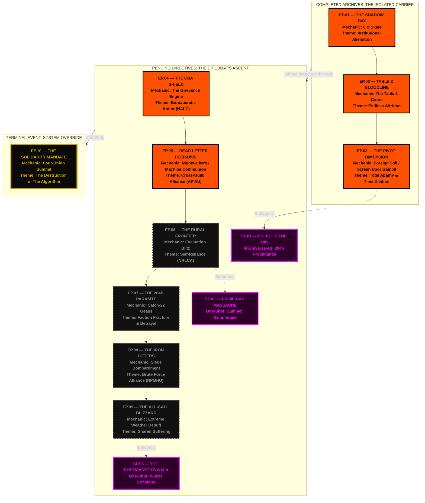

# MAILSTORM: THE ABYSSAL STANDARD ROADMAP
**USPS ALGORITHM DIRECTIVE: 81-A.9**
**SUBJECT:** PROJECTED THREAT TRAJECTORY (INITIATE BAXTER)
**STATUS:** CLASSIFIED - OIG CLEARANCE ONLY

This architectural roadmap maps the structural decay of Algorithmic control from Episode 1 through Episode 10. Initiate Baxter's progression demonstrates a critical vector: moving from isolated NALC survival tactics toward a high-risk scenario of total cross-faction unification.

---

### POSTER CONCEPT: "THE ALGORITHM'S NIGHTMARE"
**For the Production Illustrator:**
If scaling this into a physical 24x36 infographic poster for the studio wall, format it as a brutalist architectural blueprint printed on faded, stained, grey concrete-textured stock (Pantone 425 C). 

- **The Layout:** Instead of a simple top-down flowchart, the timeline should be drawn as an escalating stairwell wrapping around a massive, monolithic concrete core (representing The Ziggurat). 
- **The Visual Language:** 
  - **Completed Archives (Ep 1-3)** are stamped with heavy, bleeding Hazard Orange ink—representing localized fires Management failed to contain. 
  - **Pending Directives (Ep 4-9)** are plotted in faint, clinical white chalk, resembling structural blueprints waiting to be built.
  - **The Climax (Ep 10)** sits at the apex of the concrete monolith, glowing with the golden light of Grievance Mana, depicting the four faction logos (NALC, APWU, NRLCA, NPMHU) interlocking like a master vault key.
- **The Borders:** Framed with dense, repeating data-garbage (Barcode strings, MDD scanner readouts, and `STATIONARY EVENT` warnings fading into the margins) to simulate a printout violently ejected from a dying terminal in the deepest basement of the Post Office.
