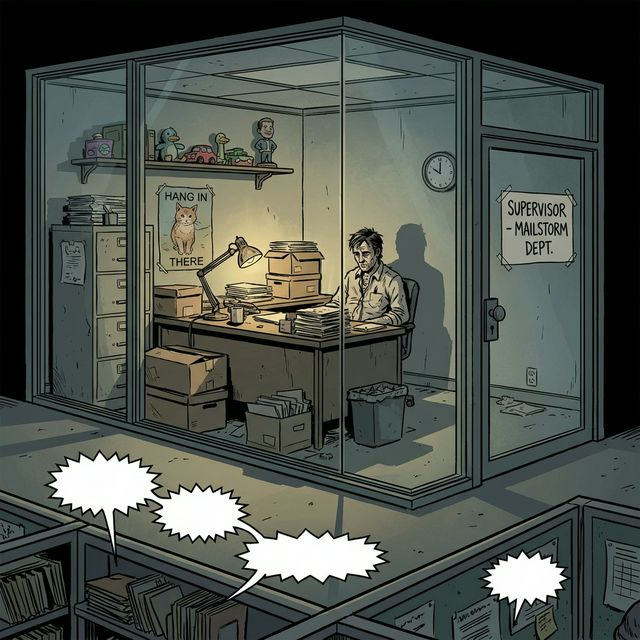
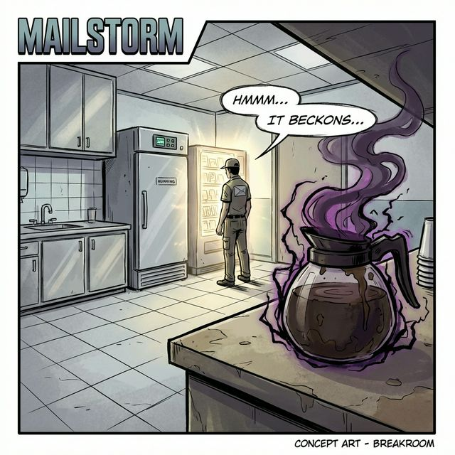

# Mailstorm Environments

## The Pit (Main Office Floor)
**Description**: Endless rows of beige cubicles. The fluorescent lights buzz with a frequency that induces anxiety.
**Vibe**: A battlefield where the war is fought with emails and passive-aggressive notes.

## Chuck's Office
**Description**: A glass-walled aquarium of incompetence. It overlooks "The Pit" so Chuck can micromanage, but mostly he just plays with toys.
**Details**: Cluttered, chaotic, trying too hard to be "cool boss" while also being a tyrant.

## The Breakroom
**Description**: A neutral zone... mostly.
**The Coffee Pot**: Sources say the coffee is brewed from the souls of the damned (or just really old beans). It helps Sparky vibrate through time.
**The Vending Machine**: A beacon of hope, or a monolith of temptation.

